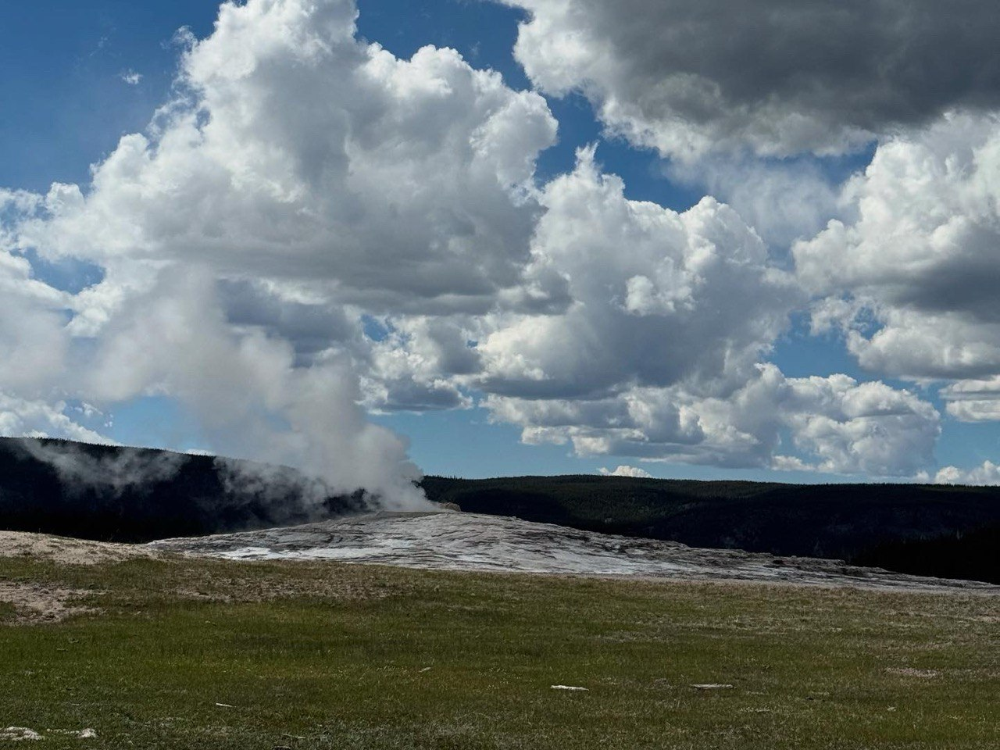
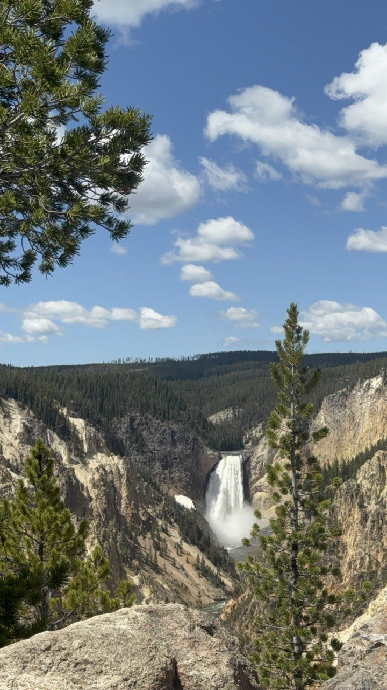
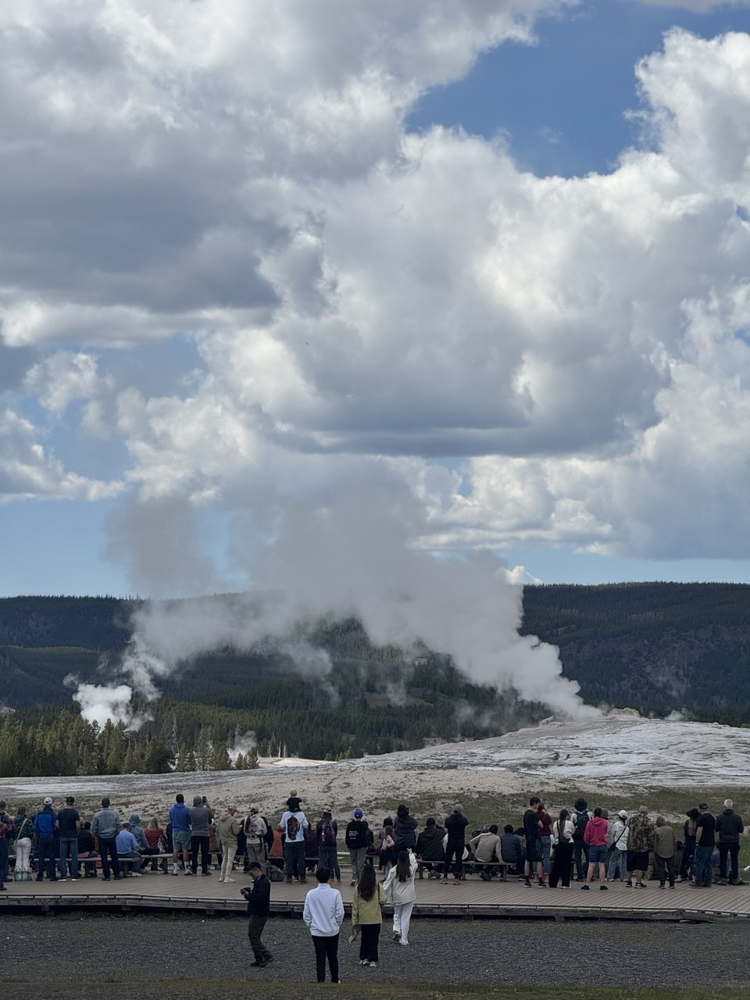
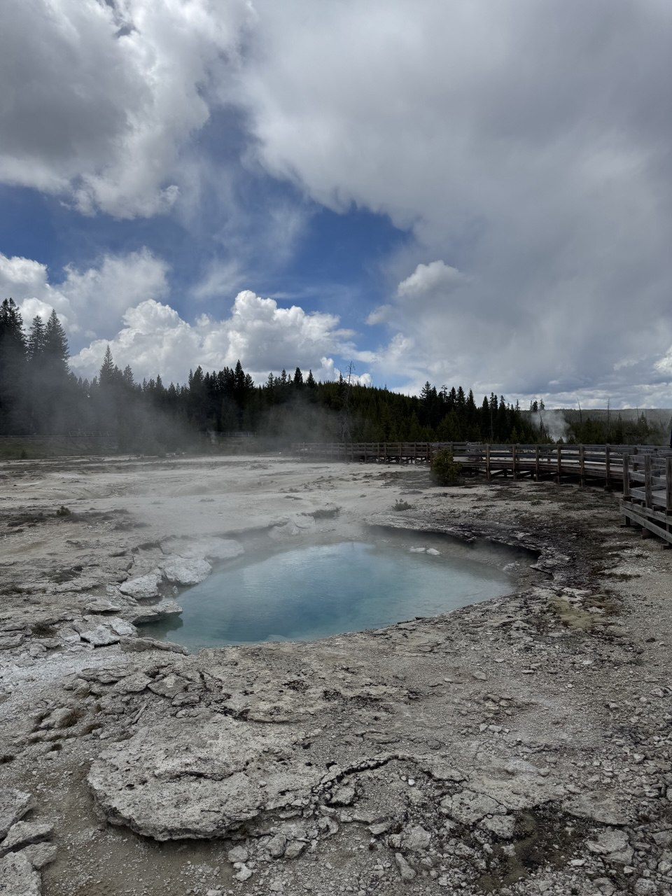
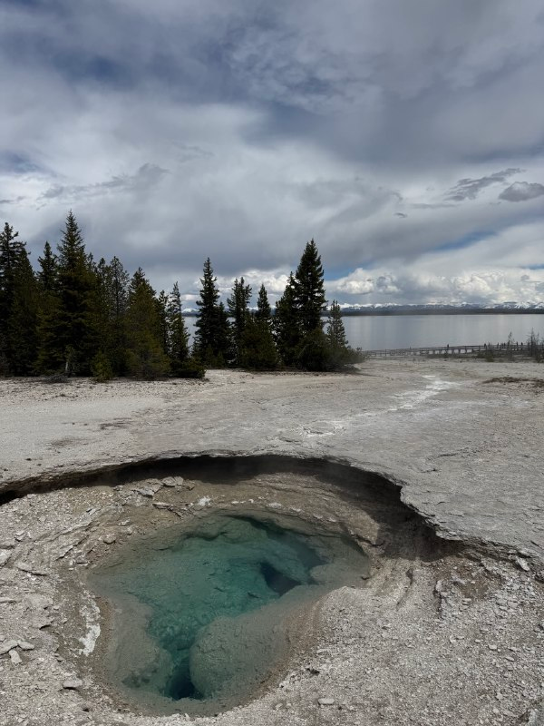
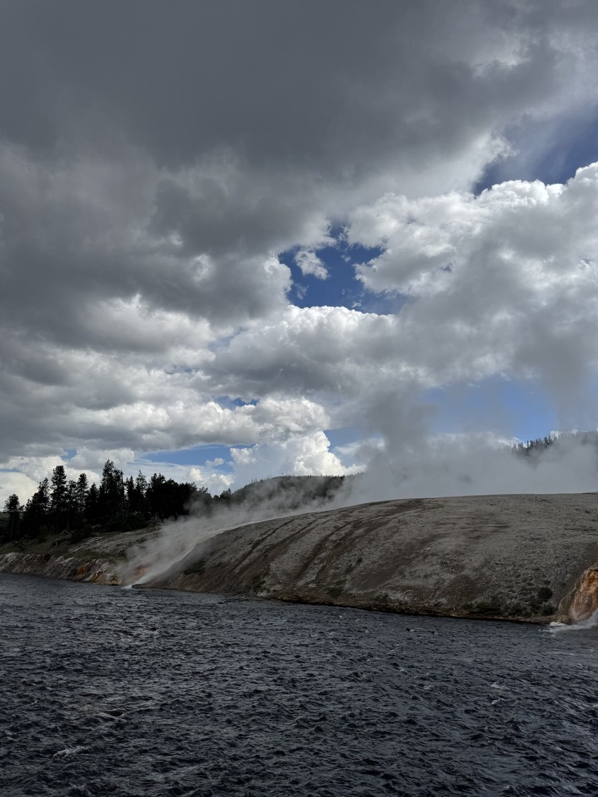
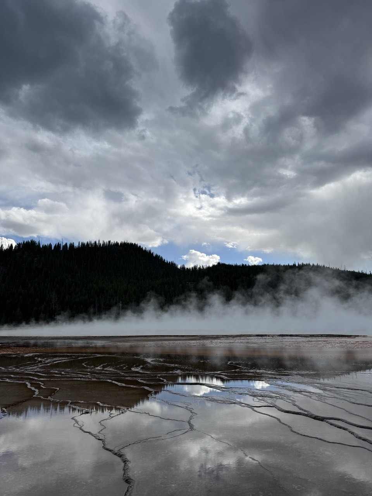

# PhD Student in Computer Science
[University of Utah](https://www.utah.edu/) | [Flux Research Group](https://www.flux.utah.edu/)

## About

I'm a PhD student at the [Kahlert School of Computing](https://www.cs.utah.edu/) at the University of Utah (since 2022), where I work with [Prof. Robert Ricci](https://ricci.io) as part of the [Flux Research Group](https://www.flux.utah.edu/). My research focuses on cloud computing, serverless systems, and applying machine learning to solve challenges in networking and security.

Read more about my research approach here:
[Research Overview →](research.md)

I'm open to research collaborations in my research areas. Feel free to reach out through my email!

 Also, please drop me an email if you’d like a copy of my updated CV.

## Contact

**Email**: Ghazal [dot] Abdollahi [at] utah.edu

-------------------------------------------------
## 🌐 Conferences & Workshops

Selected conferences, workshops, and summits I have **participated in**:

- **ACM HotNets 2025** — University of Maryland, MD, USA  
- **NSDI 2025** — Philadelphia, PA, USA  
- **AI Summit 2025** — University of Utah, Salt Lake City, UT, USA  
- **KubeCon 2024** — Salt Lake City, UT, USA  
- **ACM CCS 2024** — Salt Lake City, UT, USA  
- **ML & Big Data HPC Workshop** — INSCC, University of Utah

-------------------------------------------------
## 📍 Salt Lake City, Utah, USA

Salt Lake City is a quiet mountain city surrounded by peaceful scenery and genuinely nice people. You’re only minutes to hours from spectacular landscapes—national parks like Yellowstone (yes, technically not in Utah, but much closer from here), lakes such as Mirror Lake and Silver Lake, and many outdoor trails. It’s an ideal place for a PhD student who wants to live close to nature and far from the hustle and bustle of a crowded city

## 📸 Gallery

  
  
  

  
  
  

  
  

-------------------------------------------------

## 📖🎧 Recent favorite Books & Podcasts
- **[The Let Them Theory — Mel Robbins](https://www.melrobbins.com/book/the-let-them-theory/)**  
  _A practical lens on agency, focus, and action in complex work and life._

- **[The Diary Of A CEO](https://www.youtube.com/channel/UCGq-a57w-aPwyi3pW7XLiHw)**  
  _Long-form conversations about motivation, leadership, and personal evolution._

-------------------------------------------------

