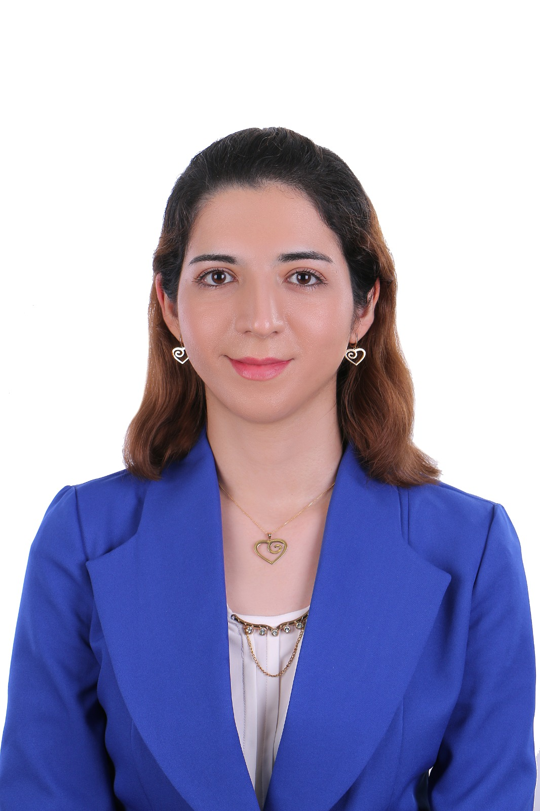
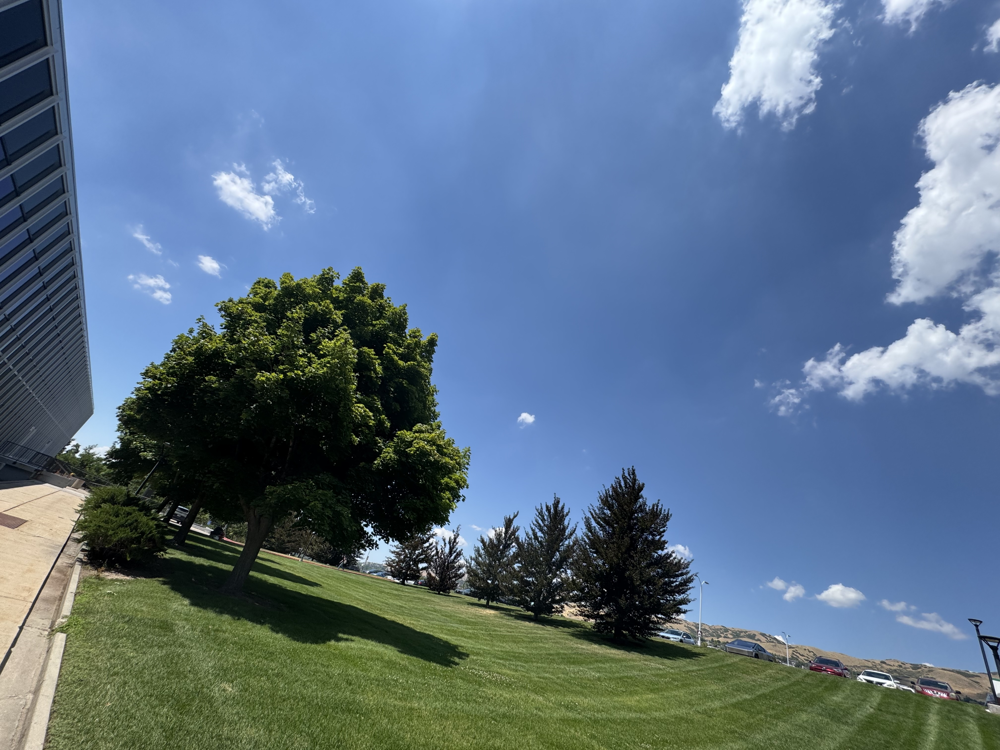

  

# PhD Candidate in Computer Science
[University of Utah](https://www.utah.edu/) | [Flux Research Group](https://www.flux.utah.edu/)

## About

I'm a PhD student at the [Kahlert School of Computing](https://www.cs.utah.edu/) at the University of Utah (since 2022), where I work with [Prof. Robert Ricci](https://ricci.io) as part of the [Flux Research Group](https://www.flux.utah.edu/). My research focuses on cloud computing, serverless systems, and applying machine learning to solve challenges in networking and security.

Read more about my research approach here:
[Research Overview →](research.md)

  
   
  <em>Photo taken at MEB, my office building, Summer 2026.</em>
   

I love how this quote make sense in my research process:
  "It goes always, bit by bit. You don't see the whole thing at once.
  The way it unfolds is anybody's guess. It's kind of a magical thing.
  But eventually, it gets there. If you focus on it, it'll draw other
  ideas in. And... but you don't know. Like fishing, you have to have
  patience. You don't know how long it'll take. But if you keep
  focusing on it, it'll... and wiggle the line a little bit, it'll
  bring them in. Intuition is the intellect and emotions swimming
  together." — David Lynch

I'm open to research collaborations in my research areas. Feel free to reach out through my email!
## Contact

**Email**: Ghazal [dot] Abdollahi [at] utah.edu

**Status =  ACTIVELY seeking POSTDOC opportunities 🔭**

-------------------------------------------------
## 🌐 Conferences & Workshops

Conferences, workshops, and summits I have **presented/attended** at:
- **AI Convergence Summit 2026** — University of Utah, SLC, UT, USA 
- **USENIX PEPR '26** — Santa Clara, CA, USA
- **IEEE SmartCloud 2026** — NYC, New York City, USA
- **NDSS 2026** — San Diego, CA, USA
- **ACM HotNets 2025** — University of Maryland, MD, USA  
- **NSDI 2025** — Philadelphia, PA, USA  
- **AI Summit 2025** — University of Utah, Salt Lake City, UT, USA  
- **KubeCon 2024** — Salt Lake City, UT, USA  
- **ACM CCS 2024** — Salt Lake City, UT, USA  
- **ML & Big Data HPC Workshop** — INSCC, University of Utah, USA

-------------------------------------------------
## 📍 Salt Lake City, Utah, USA

Salt Lake City is a quiet mountain city surrounded by peaceful scenery and genuinely nice people. You’re only minutes to hours from spectacular landscapes; national parks like [Yellowstone](https://www.nps.gov/yell/index.htm) (not in Utah, but much closer from here), lakes such as Mirror Lake and Silver Lake, and many outdoor trails. It’s an ideal place for a PhD student who wants to live close to nature and far from the hustle and bustle of a crowded city.

## 📸 Gallery
Here are photos I took during my visit to Yellowstone in Spring 2025:
[Yellowstone — Spring 2025](gallery.html)

-------------------------------------------------

## 📖🎧 Recent favorite Books & Podcasts
- **[The Let Them Theory — Mel Robbins](https://www.melrobbins.com/book/the-let-them-theory/)**  
  _A practical lens on agency, focus, and action in complex work and life._

- **[The Diary Of A CEO](https://www.youtube.com/channel/UCGq-a57w-aPwyi3pW7XLiHw)**  
  _Long-form conversations about motivation, leadership, and personal evolution._

- **[Effortless — Greg McKeown](https://www.amazon.com/Effortless-Make-Easier-What-Matters/dp/B08FMTSZLN/)**  
  _A guide to making the most important work feel lighter, not harder._

-------------------------------------------------

