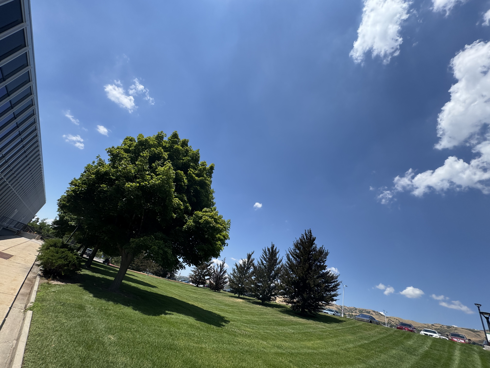

<body>
  

    

      ✕
     🎯 Status = ACTIVELY looking for a Postdoc/Tenure-track position to turn creative ideas into impact!
    

  

  
  
</body>
# PhD Candidate in Computer Science
[University of Utah](https://www.utah.edu/) | [Flux Research Group](https://www.flux.utah.edu/)

## About

I'm a PhD candidate at the [Kahlert School of Computing](https://www.cs.utah.edu/) at the University of Utah (since 2022), where I work with [Prof. Robert Ricci](https://ricci.io) as part of the [Flux Research Group](https://www.flux.utah.edu/). My research is about how computing systems can notice what is forming in their own data early enough to act on it, in a way people can follow. I call this Interpretable Signal-to-Control (O→S→C: observation, signal, control), and I have developed it in serverless computing, data center networking, and network security.

**On the academic job market, 2026–27** (tenure-track and postdoctoral positions).

[CV](assets/cv.pdf) | [Research Statement](assets/research-statement.pdf) | [Teaching Statement](assets/teaching-statement.pdf)

Read more about my research approach here:
[Research Overview →](research.md)

  
   
  <em>Photo taken at MEB, my office building, Summer 2026.</em>

  

I love how this quote makes sense in my research process:
  "It goes always, bit by bit. You don't see the whole thing at once.
  The way it unfolds is anybody's guess. It's kind of a magical thing.
  But eventually, it gets there. If you focus on it, it'll draw other
  ideas in. And... but you don't know. Like fishing, you have to have
  patience. You don't know how long it'll take. But if you keep
  focusing on it, it'll... and wiggle the line a little bit, it'll
  bring them in. Intuition is the intellect and emotions swimming
  together." — David Lynch

I'm open to research collaborations in my research areas. Feel free to reach out through my email!
## Contact

**Email**: Ghazal [dot] Abdollahi [at] utah.edu

**Status = ACTIVELY seeking POSTDOC and TENURE-TRACK opportunities 🔭**

## 💡 What My Papers Have Taught Me

- **Serverless:** cold starts and idle containers are one problem, not two. Reading how long a function runs and how soon it will be called again lets a platform steady both at once, with rules an operator can read line by line.
- **Data center networking:** flow populations show structure before any single flow can be classified. Following that idea to its limit led me to the "reactive wall", a negative result that taught me more than the cases where the method worked.
- **Security:** SSH logs hold millions of attempts and little direct evidence of intent. Looking at attacker populations instead of single events reveals who is attacking, and when independently trained learners disagree about an attacker, that disagreement is itself an early sign of a campaign in transition.
- **Across all three:** the useful signals took similar shapes in fields that rarely cite one another, which is the question I most want to keep exploring.

The papers themselves are on [Google Scholar](https://scholar.google.com/citations?hl=en&user=d8byHrIAAAAJ).

<h3>Teaching Experience</h3>

<strong>Teaching Assistant</strong>, CS 4000 – Senior Capstone Design, University of Utah (Fall 2026): This semester I am one of five TAs for a 224-student senior capstone course. I read and ranked close to 200 project proposals during team formation, and I now meet my teams for thirty minutes every week to press on data, novelty, scope, and milestones, including projects sponsored by WebBank and the Huntsman Cancer Institute. Staying with a team's idea week after week and helping it become something real has been the best part of the semester.

-------------------------------------------------
## 🌐 Conferences & Workshops

Conferences, workshops, and summits I have **presented/attended** at:
- **ACM MobiCom 2026** — Austin, TX, USA *(N2Women Travel Grant)*
- **ACM RecSys 2026** — Minneapolis, Minnesota, USA
- **PMAPS 2026** — Salt Lake City, UT, USA *(Student Volunteer)*
- **SIGCOMM 2026** — Denver, Colorado, USA
- **AI Convergence Summit 2026** — University of Utah, SLC, UT, USA 
- **USENIX PEPR '26** — Santa Clara, CA, USA
- **IEEE SmartCloud 2026** — NYC, New York City, USA
- **NDSS 2026** — San Diego, CA, USA
- **ACM HotNets 2025** — University of Maryland, MD, USA  
- **NSDI 2025** — Philadelphia, PA, USA  
- **AI Summit 2025** — University of Utah, Salt Lake City, UT, USA  
- **KubeCon 2024** — Salt Lake City, UT, USA  
- **ACM CCS 2024** — Salt Lake City, UT, USA  
- **ML & Big Data HPC Workshop** — INSCC, University of Utah, USA

-------------------------------------------------
## 📍 Salt Lake City, Utah, USA

Salt Lake City is a quiet mountain city surrounded by peaceful scenery and genuinely nice people. You’re only minutes to hours from spectacular landscapes; national parks like [Yellowstone](https://www.nps.gov/yell/index.htm) (not in Utah, but much closer from here), lakes such as Mirror Lake and Silver Lake, and many outdoor trails. It’s an ideal place for a PhD student who wants to live close to nature and far from the hustle and bustle of a crowded city.

## 📸 Gallery
Here are photos I took during my visit to Yellowstone in Spring 2025:
[Yellowstone — Spring 2025](gallery.html)

-------------------------------------------------

## 📖🎧 Recent favorite Books & Podcasts
- **[The Let Them Theory — Mel Robbins](https://www.melrobbins.com/book/the-let-them-theory/)**  
  _A practical lens on agency, focus, and action in complex work and life._

- **[The Diary Of A CEO](https://www.youtube.com/channel/UCGq-a57w-aPwyi3pW7XLiHw)**  
  _Long-form conversations about motivation, leadership, and personal evolution._

- **[Effortless — Greg McKeown](https://www.amazon.com/Effortless-Make-Easier-What-Matters/dp/B08FMTSZLN/)**  
  _A guide to making the most important work feel lighter, not harder._

-------------------------------------------------

